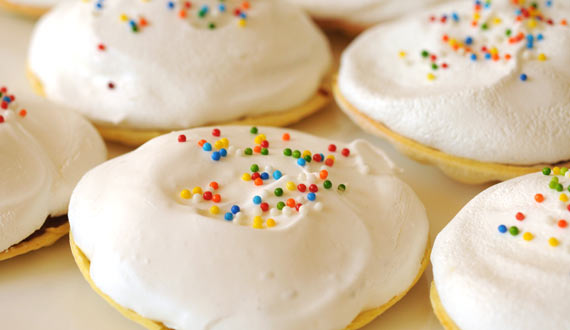
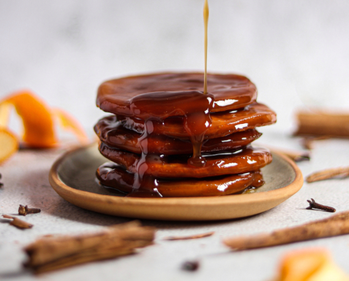
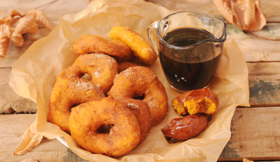
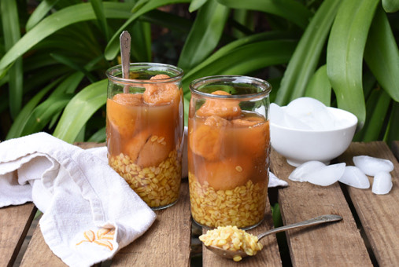

# Diseno-de-Landing-Blog
Diseño de Landing / Blog / UDD

<!DOCTYPE html>
<html lang="en">
<head>
  <meta charset="UTF-8">
  <meta http-equiv="X-UA-Compatible" content="IE=edge">
  <meta name="viewport" content="width=device-width, initial-scale=1.0">
  <link rel="stylesheet" href="estilos.css">
  <title>Repostería Chilena</title>
</head>

<body>
  <header>
    <nav>
      

        

          
        

        

          <a href="#">
            
 Sandy Painevilos

            Repostera Chilena
          </a>
        

      

      

        <a href="mailto:reposteria.chilena@sandyrpch.cl">
          ¿Quieres compartir tu receta? ¡Envíame un correo!
        </a>
      

    </nav>
  </header>

  <main>
    

      <h1> 
        Mi dulce Chile
      </h1>
      

        Rescatando recetas clásicas de la gastronomía Chilena
      

    

    

      

        

          
        

        

        

          
            
            Dificultad - Baja
          
          <a href="./paginas/articulo1.html">
            

              Chilenitos
            

          </a>
          
            <h4> Tiempo Preparación</h4>
          
 
          30 minutos
          
 
          12 unidades
        

          
            

              <time datetime="2023-04-03">
                Abril 03, 2023
              </time>
            

          

        

      

      

        

          
        

        

        

          
            
            
            Dificultad - Media
          
          <a href="./paginas/articulo1.html">
            

              Sopaipillas pasadas con chancaca
            

          </a>
          
            <h4> Tiempo Preparación</h4>
          
 
          70 minutos
          
 
          15 unidades
        

        
        
 
          

            <time datetime="2023-04-03">
              Abril 03, 2023
            </time>
          

          

        

      

    

        

          

            
          

          

          

            
              
              
              
              Dificultad - Alta
            
            <a href="./paginas/articulo1.html">
              

                Calzones rotos
              

            </a>
            
              <h4> Tiempo Preparación</h4>
            
 
            60 minutos
            

            
            30 unidades
          

          
          

            

              <time datetime="2023-04-03">
                Abril 03, 2023
              </time>
            

          

        

      

        

          

            
          

          

          

            
              
              
              Dificultad - Baja
            
            <a href="./paginas/articulo1.html">
              

                Picarones
              

            </a>
            
              <h4> Tiempo Preparación</h4>
            
 
            2 Horas
            
 
             15 unidades
          

          
          

            

              <time datetime="2023-04-03">
                Abril 03, 2023
              </time>
            

          

        

      

    

      

        
      

      

      

        
          
          Dificultad - Baja
        
        <a href="./paginas/articulo1.html">
          

            Mote con huesillo
          

        </a>
        
          <h4> Tiempo Preparación</h4>
        
 
        60 minutos con una noche de remojo 
        
 
        
        4 a 6 personas
      

      
      

        

          <time datetime="2023-04-03">
            Abril 03, 2023
          </time>
        

      

    

  

  

    
  

  

  

    
      
      Dificultad - Baja
    
    <a href="./paginas/articulo1.html">
      

        Torta curicana
      

    </a>
    
      <h4> Tiempo Preparación</h4>
    
 
    30 minutos  
    
 
    
    4 tortas
  

  
  

    

      <time datetime="2023-04-03">
        Abril 03, 2023
      </time>
    

  

  <header> 
<nav>
  <a href="Acerca de.html" >Acerca de</a>
  <a href="Contacto.html" >Contacto</a>
</header>

</nav>

          
  </main>
  
</body>
</html>
